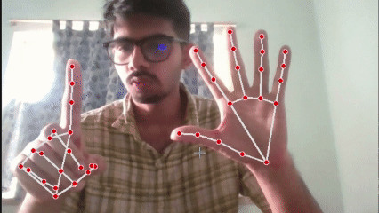

# AirNav ✨ Your Hands-Free PC Assistant



**AirNav** is a powerful Python-based suite that transforms your interaction with your computer. By combining real-time hand gesture recognition with a robust voice command system, it allows for a seamless, hands-free control experience. Move your mouse, click, drag, type, and execute complex commands—all without touching your keyboard or mouse.

This project integrates two core modules that run simultaneously:
1.  **Gesture Control**: Uses your webcam to track hand movements for precise mouse control.
2.  **Voice Control**: Uses your microphone to listen for commands, supporting both dictation and system navigation.

---

## 🚀 Core Features

* **Dual-Hand Gesture System**:
    * **Left Hand**: Controls precise cursor movement with smoothing to reduce jitter.
    * **Right Hand**: Manages actions like left-click, right-click, double-click, and drag-and-drop.
* **Dual-Mode Voice Assistant**:
    * **Command Mode**: Execute system shortcuts (`Ctrl+C`, `Alt+Tab`), navigate (`scroll up`, `enter`), and more.
    * **Typing Mode**: Dictate text directly into any application, with support for special characters and numbers.
* **Simultaneous Operation**: Both gesture and voice systems run concurrently, allowing you to move the mouse with your hand while issuing a voice command.
* **Lightweight & Responsive**: Built with efficient libraries to ensure low latency and minimal CPU usage.
* **Easy to Configure**: Key parameters like screen resolution and gesture sensitivity can be easily adjusted.

---

## 🎬 Demonstration


---

## 🛠️ Setup and Installation

### Prerequisites

* A working **webcam** (for gesture control).
* A working **microphone** (for voice control).
* **Python 3.7+**.

### Installation Steps

1.  **Clone the repository:**
    ```bash
    git clone [https://github.com/Rayan-Ghosh/AirNav.git](https://github.com/Rayan-Ghosh/AirNav.git)
    cd AirNav
    ```

2.  **Install the required libraries:**
    It's recommended to use a virtual environment.
    ```bash
    # Create and activate a virtual environment (optional but recommended)
    python -m venv venv
    source venv/bin/activate  # On Windows, use `venv\Scripts\activate`

    # Install all dependencies
    pip install -r requirements.txt
    ```

    The `requirements.txt` file should contain:
    ```
    opencv-python
    mediapipe
    numpy
    pynput
    SpeechRecognition
    pyautogui
    PyAudio
    ```

---

## ▶️ How to Run

Simply execute the `launcher.py` script. This will start both the gesture and voice control modules in separate background processes.

```bash
python launcher.py
```

You will see "Listening for voice commands..." printed in your terminal. The gesture control window will also appear. To stop the application, press `Ctrl+C` in the terminal.

---

## 🗣️ Voice Command Guide

The assistant starts in **Command Mode**.

### Mode Switching

| Command | Action |
| :--- | :--- |
| **`typing on`** | Activates Typing Mode for dictation. |
| **`typing off`** | Deactivates Typing Mode and returns to Command Mode. |

### Command Mode Actions

| Command | Action |
| :--- | :--- |
| **`scroll up` / `down`** | Scrolls the active window vertically. |
| **`scroll left` / `right`**| Scrolls the active window horizontally. |
| **`zoom in` / `zoom out`** | Zooms in or out (simulates Ctrl + mouse wheel). |
| **`control c`** | Copies the selection. |
| **`control v`** | Pastes from the clipboard. |
| **`control a`** | Selects all content. |
| **`alt tab`** | Switches between open applications. |
| **`enter`**, **`backspace`**, **`delete`**, **`escape`** | Presses the corresponding key. |

### Typing Mode Actions

| Command | Action |
| :--- | :--- |
| **`[any phrase]`** | Types the recognized phrase followed by a space. |
| **`zero`** ... **`nine`** | Types the corresponding digit `0`...`9`. |
| **`exclamation`**, **`at the rate`**, **`hash`** | Types the corresponding symbol (`!`, `@`, `#`). |

---

## 🖐️ Hand Gesture Guide

### Left Hand: Cursor Movement
* **Move your hand**: The cursor will follow the tip of your **index finger**.

### Right Hand: Actions
* **Left Click**: Briefly pinch your **thumb and index finger** together.
* **Double Click**: Pinch your **thumb and index finger** twice in quick succession.
* **Right Click**: Briefly pinch your **thumb and middle finger** together.
* **Drag & Drop**:
    1.  Pinch and **hold** your **thumb and index finger** for about a second.
    2.  Move your left hand to drag the item.
    3.  Release the pinch to drop.

---

## ⚙️ Configuration

You can fine-tune the performance by editing these variables in the respective files:

* **`mouse_gestures.py`**:
    * `SCREEN_WIDTH`, `SCREEN_HEIGHT`: Set to your monitor's resolution.
    * `SMOOTHING`: Higher value for smoother but slower cursor movement.
    * `LEFT_CLICK_THRESHOLD`: Adjusts pinch sensitivity.
    * `DRAG_HOLD_TIME`: Time to hold a pinch to initiate a drag.
    * `DPI_FACTOR`: Adjusts Mouse DPI
* **`keyboard.py`**:
    * `symbol_map`: Add or change voice commands for symbols.

---

## ⚠️ License Notice
This project is licensed for viewing and usage only.

You may:
- Use the code as-is for personal or educational purposes.

You may **not**:
- Modify, alter, or create derivative works from this code.
- Redistribute or republish this logic without permission.

Contact the author for licensing questions or commercial usage rights.
